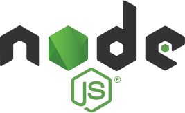

# 今月のフロントエンド

フロントエンド エンジニア集会 2025 年 5 月

---

## お知らせ

いつも使ってるスライドサービス (`tome`) がお亡くなりになりました.
PDF 出力データはかろうじて残っていますが, 原本は消失しました.

今回より `Marp` を使ってスライドを作成します.
スライドデータは https://github.com/mew-ton/meetup-slides にソースコードが残るようになります.

---

## "今月のフロントエンド" とは

今月あったフロントエンドのニュースを, 以下のフォーマットで紹介します.

- ニュースがあった技術について, その名前かキーワード
- その技術に関する解説 (3 行目安)
- 何があったかを解説

---

## 取り上げないもの

- 特定フレームワークに関するバージョンアップ (例外あり)
- AI 単品のニュース

---

# Node.js



---

## Node.js とは ?

3 行でまとめ

- サーバーサイドで動作する JavaScript 実行環境
- V8 エンジンを搭載している (chrome と同じ JS エンジン)
- 同様の JS 実行環境として Deno, Bun 等あるが, Node.js はリリースが最も早いだけあって, 利用率が高い

---

## Node.js のニュース

- 2025 年 5 月 6 日に Node.js の最新バージョン 22 がリリースされました.
- 一方で, 2025 年 4 月 30 日に バージョン 18 のサポートが終了しました.

---

## Node.js v22 での主要変更点 1

V8 エンジンのアップグレード

- V8 v13.6 に更新
- `RegExp.escape`, `Float16Array`, `Error.isError` 等が追加

npm 11 の導入

- パフォーマンスとセキュリティが向上
- 最新の JavaScript パッケージとの互換性が強化

---

## Node.js v22 での主要変更点 2

Permission Model の改善

- 実験的な Permission Model が改善され,フラグが `--experimental-permission` から `--permission` に変更された

---

## Permission Model とは ?

通常の Node.js 実行環境では,ファイルの読み書き,環境変数の参照,外部リソースへのアクセスなどが無制限に可能だった.

これにより悪意あるコードが意図しないファイルにアクセスする可能性もある.

Permission Model は,こうしたリスクを軽減するために,明示的に許可した操作以外はブロックする方式を取る.

---

## Permission Model 使用例

権限なし

```bash
node --permission index.js
```

ファイルの読み込みだけ許可

```bash
node --permission --allow-fs-read=/path/to/dir index.js
```

環境変数への参照を許可

```bash
node --permission --allow-env=API_KEY index.js
```

---

## ・・・なんとなく感じる既視感

```bash
deno run --allow-read=/path/to/dir --allow-env=API_KEY index.js
```

---

## Deno とは ?

3 行でまとめ

- Node.js の代替として開発された JavaScript/TypeScript の実行環境
- Node.js の開発者 (Ryan Dahl) が, Node.js の反省点を踏まえて開発した
- リリース当初より Permission Model を採用している

---

## Node.js と Deno の Permission Model の違い

Node.js

- 何でもできる自由さがある
- デフォルトでは全ての操作が許可されている
- `--permission` オプションを指定してはじめて, 特定の機能が制限される

Deno

- デフォルトでは全ての操作が拒否されている
- 1 つ 1 つ丁寧に許可しなければならない

---

# おわり
