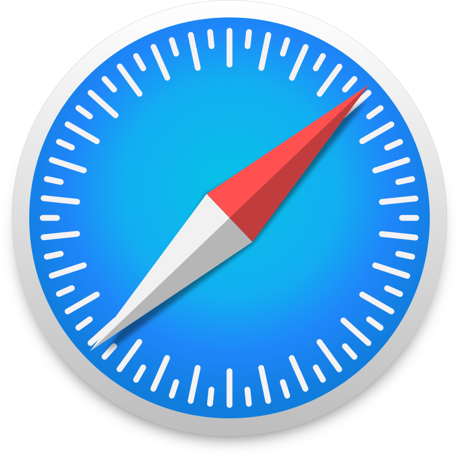
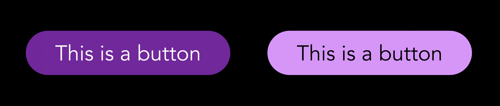
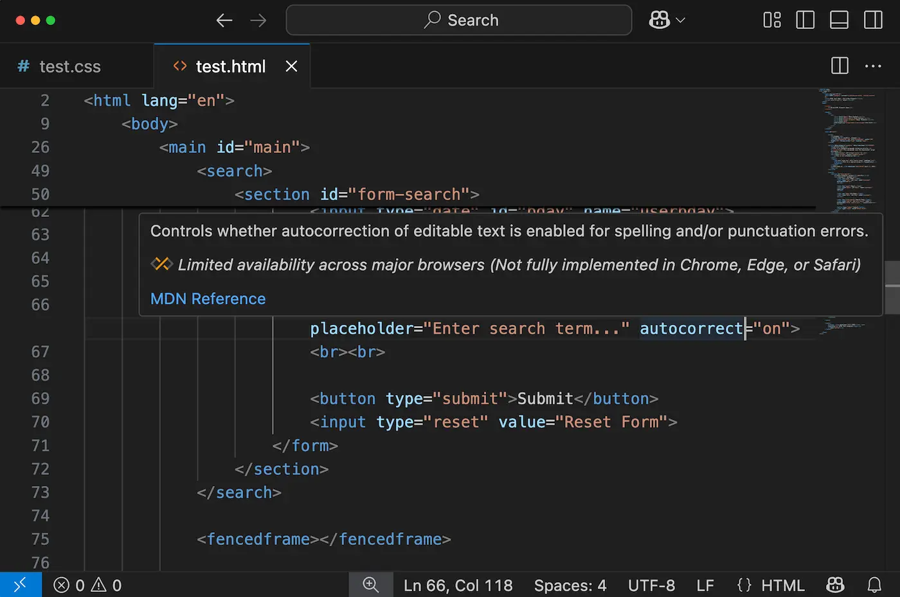

# 今月のフロントエンド

フロントエンド エンジニア集会 2025 年 6 月

---

## お知らせ

- フロントエンドカンファレンス東京 2025 ロングトーク登壇プロポーザル応募しました
- Vue-Fes Japan 2025 ロングトーク登壇プロポーザル応募も現在準備中
- なお両方当選すると死にます, 助けてください.

---

## "今月のフロントエンド" とは

今月あったフロントエンドのニュースを, 以下のフォーマットで紹介します.

- ニュースがあった技術について, その名前かキーワード
- その技術に関する解説 (3 行目安)
- 何があったかを解説

---

## 取り上げないもの

- 特定フレームワクに関するバージョンアップ (例外あり)
- AI 単品のニュース

---

# Google Chrome

2025/5/28


---

## Google Chrome とは ?

- 2008 年にリリースされた, 現在トップシェアのブラウザ
- 現在は Chrome ベースのブラウザが多く利用されている
- ブラウザのエンジンは V8 エンジンを使用

---

## Google Chrome のニュース

2025 年 5 月 28 日の Google Chrome 137 より, CSS の `if()` 関数が実装された.

---

## いままでの書き方

```css
.color {
  &.dark {
    color: white;
    background-color: black;
  },
  &.light {
    color: black;
    background-color: white;
  }
}
```

---

## if を使った書き方

```css
.color {
  color: if(style(--theme: dark), white, black);
  background-color: if(style(--theme: dark), black, white);
}
```

---

## 互換性について

Chrome 以外では現在利用できないので注意

---

# Firefox

2025/5/29


---

## Firefox とは ?

- 2004 年にリリースされた, Mozilla が開発するオープンソースブラウザ
- プライバシー保護とオープン Web を重視している
- 現在世界で 3 番目のシェアを持つブラウザ

---

## Firefox のニュース

Firefox 139 で Temporal API が初実装された

---

## Temporal API とは ?

- JavaScript の日付・時刻処理を大幅に改善する新しい API
- 現在の Date オブジェクトの問題点（タイムゾーン、型変換、ミュータブル等）を解決
- 組み込みの時間帯とカレンダー表現により、複雑な日時計算が簡単に

---

## 従来の Date vs Temporal

```javascript
// 従来の Date（問題が多い）
const date = new Date('2023-05-15');
date.setMonth(6); // 元のオブジェクトが変更される

// Temporal（不変でタイムゾーン対応）
const date = Temporal.PlainDate.from('2023-05-15');
const newDate = date.withMonth(7); // 新しいオブジェクトを返す
```

---

## 互換性について

Firefox 以外では現在利用できないので注意

---

# Safari

2025/5/15



---

## Safari とは ?

- 2003 年にリリースされた, Apple が開発するブラウザ
- macOS と iOS のデフォルトブラウザ
- WebKit エンジンを使用し, プライバシー保護を重視

---

## Safari のニュース

Safari Technology Preview で contrast-color() 関数が実装された

---

## contrast-color() とは ?

指定した色に対して最適なコントラストを持つ色を自動選択



---

## contrast-color() の使用例

```css
.button {
  --bg-color: #3498db;
  background-color: var(--bg-color);
  color: contrast-color(var(--bg-color));
  /* 自動的に適切な文字色（黒または白）が選択される */
}

.dynamic-theme {
  background: var(--user-selected-color);
  color: contrast-color(var(--user-selected-color));
}
```

---

## 互換性について

Safari 以外では現在利用できないので注意

---

# Visual Studio Code

2025/5/20


---

## Visual Studio Code とは？

- Microsoft が開発する無料のコードエディタ
- Web 開発者に最も人気があるエディタの一つ
- 豊富な拡張機能と Git 統合で開発効率を向上

---

## Visual Studio Code のニュース

Web 標準の「Web Platform Baseline」チェック機能が標準搭載された

---

## Web Platform Baseline とは？

- 主要ブラウザで確実に使える Web 標準機能のサブセット
- Chrome・Firefox・Safari 全てでサポート済みの機能のみを定義
- 開発者が安心して使える機能を明確化

---



---

## これまでの問題

各ブラウザで使える機能がバラバラで判断が困難

→ **HTMLやCSSにカーソルを合わせるだけで Baseline 対応状況が表示**

---

# TypeScript

2025/5/22


---

## TypeScript とは ?

- 2012 年にリリースされた, JavaScript のスーパーセット
- 静的型付けを導入することで, コードの安全性を向上させる
- 現在は JavaScript のデファクトスタンダード

---

## TypeScript のニュース

TypeScript Native Preview が公開された

---

### TypeScript Native Preview ?

- TypeScript のビルドシステムを go に置き換えるプロジェクトが現在進行している
- ビルドシステムを go に置き換えることで, 速度を向上させ, 開発者体験を向上させる
- そのプレビュー版が公開された.
- ロードマップとして TypeScript 7 にて標準搭載を目指している模様 (現在は 5.8)

---

# Vite

2025 / 5 / 30


---

## Vite とは ?

- 2020 年にリリースされた, ビルドツール
- 内部的に esbuild / rollup を使用している
- ビルド速度が速く, webpack からの乗り換え先として人気

---

## Vite のニュース

rolldown-vite がリリースされた


---

## Rolldown とは ?

- Rust で書かれた次世代の JavaScript バンドラー
- Vite の内部で使用されている Rollup と esbuild を置き換える目的で開発
- Oxc という高速な JavaScript ツールチェーンをベースとして構築されている

---

## rolldown-vite の特徴

- 現在の Vite の 3〜16 倍高速なビルドを実現
- 既存の Vite プロジェクトでドロップイン置換として利用可能
- 将来的には Vite 本体に統合される予定

---

# Minecraft

2025 / 5 / 26


---

## Minecraft とは ?

- 2011 年にリリースされた, ブロックを使って世界を構築するサンドボックスゲーム
- 全世界で 3 億本以上売れている史上最も売れたゲームの一つ
- Java 版, 統合版など複数のプラットフォームで展開

---

## Minecraft のニュース

HTML/CSS のみでマインクラフト風ゲームが作られ話題になった

---

## 技術的な仕組み

- CSS: わずか 480 行
- HTML: 46,022 行 (3.07MB) - 主にゲームの状態管理用
- 35,001 個の `<label>` 要素と 5,840 個の `<input type="radio">` 要素
- ラジオボタンがゲームの状態ストレージエンジンとして機能

---

## 今月のまとめ

- **Chrome**: CSS `if()` 関数で条件分岐がより簡潔に記述可能
- **Firefox**: Temporal API で JavaScript の日付・時刻処理が大幅改善
- **Safari**: `contrast-color()` 関数でアクセシブルな色選択が自動化
- **TypeScript**: Go ベースの高速ビルドシステムのプレビューがリリース
- **Vite**: Rust ベースの rolldown-vite で劇的な高速化を実現
- **Minecraft**: JavaScript なしでも複雑なゲームロジックが実装可能であることを証明

**ブラウザ3強がそれぞれ異なる分野で進化しているが、互換性は皆無という興味深い月でした！**
