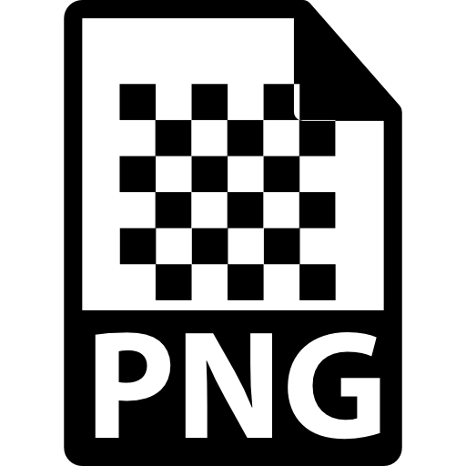

# 今月のフロントエンド

フロントエンド エンジニア集会 2025 年 7 月

---

## お知らせ

今回からスライドは AI が 9 割ほど作成しています.

---

## "今月のフロントエンド" とは

今月あったフロントエンドのニュースを, 以下のフォーマットで紹介します.

- ニュースがあった技術について, その名前かキーワード
- その技術に関する解説 (3 行目安)
- 何があったかを解説

---

## 取り上げないもの

- 特定フレームワークに関するバージョンアップ (例外あり)
- AI 単品のニュース

---

# PNG

2025/6/11

---

## PNG とは ?

- Portable Network Graphics
- 1996年にリリースされた、可逆圧縮画像フォーマット
- Web標準として広く普及し、透明度をサポート
- GIFの特許問題を解決する目的で開発された

---

## PNG のニュース

20年ぶりにPNG仕様が大幅アップデート。HDRサポート、アニメーション機能、Exifデータ対応が追加された

---

## 主要な新機能

- **HDR (High Dynamic Range) サポート**: 高輝度画像の表現が可能に
- **アニメーションPNG (APNG)**: 正式サポートでGIF代替
- **Exifデータ**: カメラ情報などのメタデータ保存
- **圧縮効率**: 次世代圧縮方法の研究継続

---

## 対応状況

**ブラウザ**: Chrome、Safari、Firefox
**OS**: iOS、macOS
**ソフトウェア**: Photoshop、DaVinci Resolve、Avid Media Composer

---

## 業界の動き

- W3Cが主導する仕様策定
- Adobe、Apple、Google、BBCなどが参画
- 主要ブラウザ・ツールで既に対応開始

---

# ECMAScript

2025/06/18

---

## ECMAScript とは？

3行でまとめ

- JavaScriptの標準仕様を定めた国際規格
- Ecma Internationalが策定し、毎年6月に新版がリリースされる
- ES2015（ES6）以降、モダンなJavaScript開発の基盤となっている

---

## ECMAScript のニュース

- 2025年6月26日、ECMAScript 2025（第16版）が正式承認されました
- 同時にECMAScript国際化API仕様（第12版）と組み込みシステムAPI仕様（第3版）も更新

---

## ECMAScript 2025の主な新機能

Iterator関連の大幅強化

- Iterator.from() - オブジェクトから新しいIteratorを作成
- Iterator.prototype のメソッド追加（map, filter, forEach等）
- Set操作の新メソッド（intersection, union, difference等）

JSON Modules の正式サポート

- type: "json" でのJSONファイルインポートが標準化
- モジュールのインポート属性構文の追加

正規表現の新機能

- RegExp.escape() メソッドの追加
- インライン修飾フラグの構文サポート

その他の新機能

- Promise.try() メソッドの追加
- Float16Array型の対応
- Object.groupBy / Map.groupBy メソッドの追加

---

## 開発者への影響

今年のアップデートは特に大きく、Iteratorの扱いやデータ操作が大幅に改善される

モダンブラウザでの段階的な実装開始が予想され、TypeScriptやBabelなどのツールチェーンでも対応準備が進められる見込み

---

# JavaScript

2025/6/27

---

## JavaScript™ とは ?

- 1995年にNetscape社が開発したプログラミング言語
- 現在はWeb開発の標準言語として世界中で使用されている
- ECMAScript仕様に基づき、ブラウザとサーバーサイドで動作

---

## JavaScript™ のニュース

Deno創設者のRyan DahlがOracle社に対し「JavaScript™」商標の無効を求める法的闘争を開始した

---

## 主な争点

- **商標の一般名称化**: 「JavaScript™」は世界中で一般的なプログラミング言語名として使用
- **商標の放棄**: Oracle社が3年以上「JavaScript™」を商用利用していない
- **詐欺行為**: 2019年にOracleがNode.js™のスクリーンショットを自社の商用利用証拠として提出

---

## 法的進展

- **6月18日**: 商標審判廷（TTAB）が詐欺申し立てを却下
- **8月7日**: Oracle社の正式応答予定
- **14,000人以上**: エンジニアが商標解放の署名に参加

---

## 業界への影響

- JavaScript™開発者コミュニティ全体に関わる重要な問題
- オープンソース文化と商標権の衝突
- プログラミング言語名の自由な使用権を巡る争い

---

# オマケ

JavaScript に類似する技術たち

---

## JavaScript™に類似する技術たち（1/2）

**Java**: 名前が似ているだけで全く別の言語

**ActionScript**: Adobe Flash用のECMAScript準拠言語

**UnityScript**: Unity向けのJavaScript™風言語（現在は廃止）

**JavaScript (Cluster)**: Cluster (メタバースプラットフォーム) のワールドスクリプト. JavaScript と表記されているが、エンジンは不明.

**CoffeeScript**: JavaScript™にコンパイルされる簡潔な構文の言語

**Dart**: Google開発、JavaScript™にコンパイル可能

---

## JavaScript™に類似する技術たち（2/2）

**JScript**: 1996年にMicrosoft社が開発したJavaScript™互換のスクリプト言語

- Internet ExplorerとWindows Scripting Hostで使用された
- *ちなみに2025年7月10日、Windows 11 24H2以降でJScriptエンジンを「JScript9Legacy」に置換と発表*

**TypeScript**: Microsoft社が開発したJavaScript™の型付きスーパーセット

**Flow**: Facebook社が開発したJavaScript™の静的型チェッカー

**Google Apps Script**: Google社が提供するJavaScript™ベースのクラウドスクリプト環境

---

## 今月のまとめ

- **PNG**: 20年ぶりの仕様更新でHDR・アニメーション・Exif対応
- **ECMAScript**: 2025年版でIterator関連機能を大幅強化
- **JavaScript**: 商標権を巡りOracle社との法的闘争が開始
