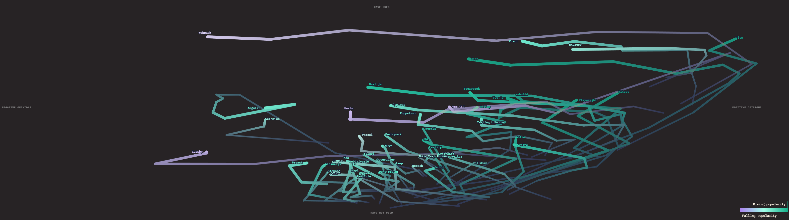
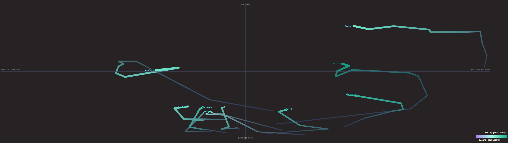
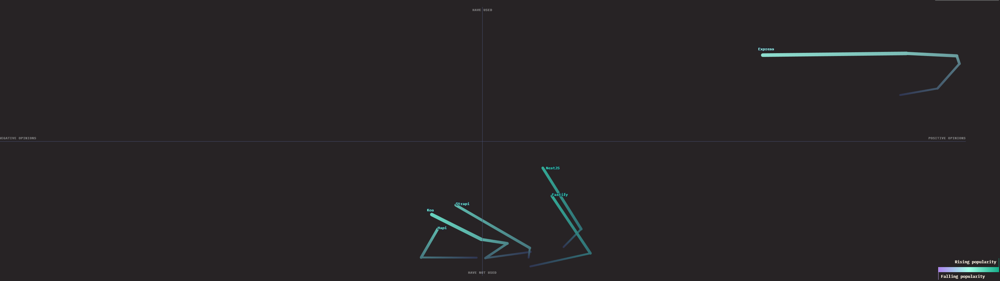
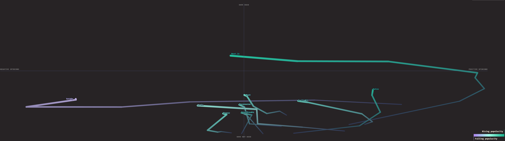
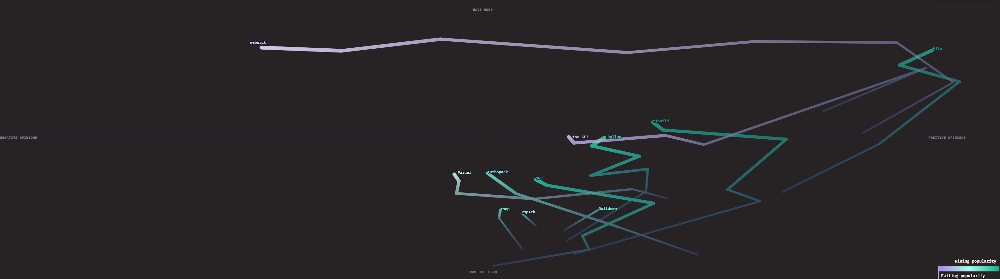
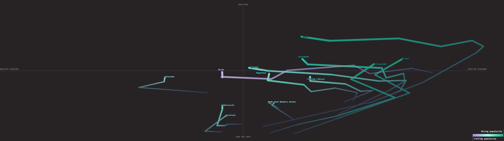

# 今月のフロントエンド

フロントエンド エンジニア集会 2026 年 2 月

---

## "今月のフロントエンド" とは

今月あったフロントエンドのニュースを, 以下のフォーマットで紹介します.

- ニュースがあった技術について, その名前かキーワード
- その技術に関する解説 (3 行目安)
- 何があったかを解説

---

## 取り上げないもの

- 特定フレームワークに関するバージョンアップ (例外あり)
- AI 単品のニュース

---

## Vite

2026/01/21

---

## "Vite" とは

- 現代の Web フロントエンド開発におけるデファクトスタンダードなビルドツール
- 開発時は ES Modules を利用して爆速な起動を実現 (No Bundle)
- ビルド時は Rollup を内部で利用し、高効率なバンドルを生成する

---

## Vite のニュース

**Rolldown への移行が本格化 (Vite 8 Beta / Rolldown 1.0 RC)**

- Vite の次世代バンドラーである **Rolldown** (Rust 製) が 1.0 RC に到達
- これに伴い、Vite の次期バージョン (v8) でのデフォルト採用が見えてきた
- esbuild (Go) と Rollup (JS) の役割を統合し、**Rust による更なる高速化と安定性** を提供

<!-- _footer: "出典: [Rolldown](https://rolldown.dev/)" -->

---

## "Rolldown" とは

- Vite チームが開発している、**Rust 製の高速バンドラー**
- esbuild の「爆速」と Rollup の「柔軟性・互換性」の両立を目指す
- 将来的に Vite の基盤となり、ビルドパフォーマンスを劇的に向上させる

---

## JavaScript

2026/02/04

---

## "JavaScript" とは

- Web ブラウザで動作する標準的なプログラミング言語
- ECMAScript として標準化され、年次リリースで機能拡張が続いている
- フロントエンドだけでなく、サーバーサイド (Node.js) など幅広く利用される

---

## JavaScript のニュース

**State of JS 2025 調査結果が公開される**

- **AI コード生成の利用率が 29% に急増** (前回 20% から大幅増)
- TypeScript の利用率がさらに上昇し、ほぼ **"標準 (Standard)"** の地位を確立 (77%)
- 特定フレームワークへの熱狂 ("Peak Framework") が落ち着き、安定と成熟のフェーズへ

<!-- _footer: "出典: [State of JS 2025](https://stateofjs.com/)" -->

---

## React

2026/02/16

---

## "React" とは

- Meta (旧 Facebook) が開発する、UI 構築のための JavaScript ライブラリ
- 宣言的な View とコンポーネントベースのアーキテクチャが特徴
- 巨大なエコシステムを持ち、Web フロントエンド開発の事実上の標準の一つ

---

## React のニュース

**State of React 2025 調査結果が公開される**

- **Next.js の圧倒的なドミナンス** が継続中
- React 19 と **Server Components (RSC)** への関心が高い一方で、学習コストへの懸念も
- 状態管理は Redux から Zustand などの軽量ライブラリへの移行が進んでいる

<!-- _footer: "出典: [State of React 2025](https://stateofreact.com/)" -->

---

## Toyota

2026/02/01

---

## "Toyota" とは

- 言わずと知れた、日本を代表する世界最大級の自動車メーカー
- 近年は "Mobility for All" を掲げ、ソフトウェアファーストな開発体制への変革を進めている
- IVI などの開発で Web 技術や Flutter を積極的に採用している

---

## Toyota のニュース

**内製ゲームエンジン "Fluorite" を発表**

- トヨタ (TCNA) が開発した、**Flutter ベース** の 3D ツール / ゲームエンジン
- オープンソース (OSS) として公開予定で、すでに公式サイトもローンチ
- Flutter は Web にも対応しているため、**Web 技術周辺の文脈** としても非常に興味深い

<!-- _footer: "出典: [Fluorite](https://fluorite.game/) / [GameMakers.jp](https://gamemakers.jp/article/2026_02_09_130705/)" -->

---

# おまけ

STATE OF JS 2025 / Changes Over Time を眺めてみる

---

# Changes Over Time とは ?

- "利用率とモチベーションの推移" のグラフ
- JavaScript においては, かなり特徴的な "ブーメランパターン" が見える
- 右か上に向かっている技術には注意を払う価値がある

---

# Changes Over Time の見かた

**横軸 .. モチベーション**

右に行くほど肯定的

**縦軸 .. 利用率**

上に行くほど多くの人が使っている

---

# Changes Over Time の見かた

**推移 .. 意欲**

上向き .. 利用率が増加している
右向き .. 学びたい, また利用したいと思うユーザが増加

**色 .. 人気度**

紫に近いほど人気の下落が激しい

---
<!-- _backgroundColor: #272325 -->
<!-- paginate: false -->

---

<!-- _backgroundColor: #272325 -->
<!-- paginate: false -->

---

<!-- _backgroundColor: #272325 -->
<!-- paginate: false -->

---

<!-- _backgroundColor: #272325 -->
<!-- paginate: false -->

---

<!-- _backgroundColor: #272325 -->
<!-- paginate: false -->

---

<!-- _backgroundColor: #272325 -->
<!-- paginate: false -->

---

# 傾向 1: ブーメランパターン

- React .. 圧倒的人気ながら, まっすぐ左に向かっている
- Next .. React ほど利用率はないが, 勢いよく左に向かっている
- express .. 左に向かい始めているが, 圧倒的人気と利用率のまま
- WebPack .. ほぼ役目を追えたという感じ
- Jest .. どんどん左に向かっている

---

# 傾向 2: 要注意

- Astro .. 真上に伸びる傾向
- Vue .. 一度ブーメランパターンを経たあとに, 再び右肩上がりになっている
- Angular .. 急勾配で折れ曲がったが, それまでは右上に向かい直していた
- Vite, Vitest, Playwright .. 右上に伸びている

---

# おわり
