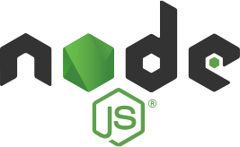

# 今月のフロントエンド 前編

フロントエンド エンジニア集会 2026 年 3 月

---

## "今月のフロントエンド" とは

今月あったフロントエンドのニュースを, 以下のフォーマットで紹介します.

- ニュースがあった技術について, その名前かキーワード
- その技術に関する解説 (3 行目安)
- 何があったかを解説

---

## 取り上げないもの

- 特定フレームワークに関するバージョンアップ (例外あり)
- AI 単品のニュース

---

## 今月は前後編で紹介します

- **前編 (今回)**: 一般的な注目のニュース
- **後編**: React / Next に注目したニュース

---

## Node.js

2026/03/12

---

## "Node.js" とは

- サーバーサイドで JavaScript を実行するランタイム環境
- Chrome の V8 エンジンを採用し, 非同期 I/O 処理を得意とする
- フロントエンドのビルドツールや開発サーバーの基盤としても広く使われている

---

## Node.js のニュース

**リリースサイクルが 10 年ぶりに刷新**

- 奇数 = 試験版 / 偶数 = 安定版 という従来の区別を廃止
- 毎年 4 月にメジャーリリース → **10 月に LTS 昇格** (30 カ月サポート保証)
- **全バージョンが LTS 対象** に
- バージョン番号は **西暦下二桁** を採用 (例: 2027 年リリース → Node.js 27)

<!-- _footer: "出典: [「Node.js」のリリースサイクルが10年ぶりに刷新、すべてのバージョンは「LTS」に](https://forest.watch.impress.co.jp/docs/news/2092630.html)" -->

---

## なぜ今, 刷新が必要だったか

- ボランティアベースの開発では **複数リリースラインの維持が困難** に
- セキュリティリリースが延期される事態が発生していた
- 新体制により **開発リソースを 1 本に集中** させ, 持続可能な運営へ

---

## VoidZero

2026/03/13

---

## "VoidZero" とは

- Vue.js / Vite の作者 Evan You が設立した, JS ツールチェーン開発に特化したスタートアップ
- Vite / Vitest / Rolldown / Oxlint など, 現代のフロントエンド開発の基盤ツールを手がける
- 「JavaScript エコシステムの統合」を掲げ, Rust ベースの高速ツール群を開発中

---

## VoidZero のニュース

**Vite+ Alpha 版を OSS として公開**

- Vite / Vitest / Oxlint / Rolldown / tsdown を統合した **統合ツールチェーン**
- `vp dev`, `vp build`, `vp check` など統一されたコマンドで全操作を管理
- MIT ライセンスで完全オープンソース化

<!-- _footer: "出典: [Announcing Vite+ Alpha: Open source. Unified. Next-gen.](https://voidzero.dev/posts/announcing-vite-plus-alpha)" -->

---

## "Vite+" とは

- VoidZero が開発する次世代の統合 Web 開発ツールチェーン
- ビルド / Lint / テスト / フォーマットだけでなく, **パッケージマネージャーや Node.js バージョン管理まで統合**
- 単一の `vite.config.ts` で全ツールの設定が完結

---

## Vite+ が統合するもの

| 役割 | これまで | Vite+ |
|---|---|---|
| ビルド | Rollup / esbuild | Rolldown |
| Lint | ESLint | Oxlint |
| フォーマット | Prettier | Oxfmt |
| テスト | Vitest (別管理) | Vitest (統合) |
| パッケージマネージャー | npm / pnpm / yarn (使い分け) | `vp` が自動選択 |
| Node.js バージョン管理 | nodeenv / volta (別途導入) | Vite+ が内包 |

---

## ツールチェーンの "統合" という流れ

- **「何を使うか」を選ばなくていい** → パッケージマネージャーも Node.js バージョンも `vp` が解決
- 長年の「npm か pnpm か yarn か」「volta か nodeenv か」論争が不要に
- Rust ベースのコアにより, JS ベースのツールとは桁違いのパフォーマンス

---

## 「選ばなくていい」の裏側

メリット: セットアップコストがゼロ, チーム間の環境差異がなくなる

デメリット: **ツールの選択肢を失う**

- ESLint の細かいルール設定や独自プラグインが使えなくなる可能性
- Vite+ に乗れないプロジェクト (モノレポ, 特殊構成) はどうなるか
- 「1つのツールへの依存」というリスクは OSS でも変わらない

---

## npm

2026/03/03

---

## "npm" とは

- Node.js に付属する JavaScript のパッケージマネージャー
- npmjs.com でパッケージの検索・公開・管理ができる公式レジストリ
- 登録パッケージ数は **300 万以上** で, 世界最大のソフトウェアレジストリ

---

## "npmx" とは

- npm レジストリを高速・快適に閲覧するための **モダンな Web クライアント**
- パッケージのインストールサイズ, ESM/CJS 対応状況, 依存関係の警告などを表示
- Daniel Roe (Nuxt コアチーム) らが中心となって開発, Alpha 版が公開

<!-- _footer: "出典: [Announcing npmx: a fast, modern browser for the npm registry](https://npmx.dev/blog/alpha-release)" -->

---

## npmjs.com と npmx の比較

| | npmjs.com | npmx |
|---|---|---|
| 表示速度 | 標準 | 高速 |
| ESM/CJS 対応状況 | 非表示 | 表示 |
| インストールサイズ | 非表示 | 表示 |
| 多言語対応 | なし | 19 言語 |

---

## コミュニティ駆動の成長

- 最初のコミットから 2 週間で **約 20 分に 1 件** のペースで Issue/PR が投稿
- アクセシビリティ・国際化を重視する文化がグローバルなコントリビューターを呼び込む
- 公開 16 日で **105 人以上のコントリビューター, 1,500 スター** を獲得

---

## React Native

2026/02/24

---

## "React Native" とは

- Meta が開発するクロスプラットフォームフレームワーク
- JavaScript / React の知識だけで iOS / Android のネイティブアプリを構築できる
- Web の React とコンポーネントモデルを共有しつつ, ネイティブ UI を描画する

---

## React Native のニュース

**Meta Quest (VR デバイス) への公式対応**

- Meta Horizon OS は Android ベースのため, **既存の React Native / Expo の知識がそのまま使える**
- `expo-horizon-core` プラグインを追加するだけで Quest 向けビルドが可能
- コントローラー / ハンドトラッキング入力, リサイズ可能ウィンドウへの対応が必要

<!-- _footer: "出典: [React Native Comes to Meta Quest](https://reactnative.dev/blog/2026/02/24/react-native-comes-to-meta-quest)" -->

---

## "Learn once, write anywhere" が VR へ

- React Native の哲学 **「一度学べば, どこでも書ける」** が VR デバイスにまで拡張
- Web → モバイル → **VR** と, React エコシステムの射程が広がり続けている
- フロントエンドの知識が活きる場所がまた一つ増えた

---

# 今月のフロントエンド 後編

フロントエンド エンジニア集会 2026 年 3 月

---

## 後編のテーマ

React と Next.js について

---

## React

---

## "React" とは

- Meta が開発・公開した UI 構築のための JavaScript ライブラリ
- コンポーネント単位で UI を組み立てる考え方を広め, 現代フロントエンドの礎となった
- **React Server Components (RSC)** により, サーバー / クライアントの境界を柔軟に制御できる

---

## Next.js

---

## "Next.js" とは

- Vercel が開発する React ベースのフルスタックフレームワーク
- SSR / SSG / ISR など多様なレンダリング戦略に対応し, 本番運用の事実上の標準
- 独自のビルドシステム (Turbopack) を持ち, **Vite とは別路線** を歩む

---

## vinext

2026/02/24

---

## "vinext" とは

- Cloudflare のエンジニアが AI の支援を受けて **1 週間で開発** した Vite ベースの Next.js 互換フレームワーク
- 既存の Next.js プロジェクト (app/, pages/, next.config.js) をそのまま動かせる
- `vinext deploy` 1 コマンドで Cloudflare Workers へデプロイ可能

---

## vinext のニュース

**"Next.js を Vite 上に 1 週間で再実装"**

- 本番ビルドが最大 **4.4 倍高速化**, クライアントバンドルサイズが **57% 削減**
- 開発費用は API トークン代の **約 1,100 ドル** のみ
- AI が "Next.js の再実装" を現実にしてしまった衝撃

<!-- _footer: "出典: [How we used AI to rebuild Next.js in a week](https://blog.cloudflare.com/vinext/)" -->

---

## FUNSTACK Static

2026/01/19

---

## "FUNSTACK Static" とは

- uhyo 氏が開発した **サーバー不要の React フレームワーク** (Vite プラグインとして実装)
- 独自 CLI は不要で `vite dev` / `vite build` がそのまま使える
- **RSC をサーバーなしで実現**: 静的ファイルのみでデプロイ可能

---

## FUNSTACK Static のニュース

**"サーバーなし RSC" という新しいアプローチ**

- RSC を静的ビルド時に処理することで, バンドルサイズ削減とクライアント負荷軽減を両立
- 独自 API `defer()` でチャンク分割にも対応
- ルーターや Server Actions は非搭載 → 既存ライブラリと組み合わせる設計

<!-- _footer: "出典: [サーバーの無いReactフレームワークFUNSTACK Static](https://zenn.dev/uhyo/articles/funstack-static-first-release)" -->

---

## Void

2026/03/16

---

## "Void" とは

- VoidZero が開発する **Vite ネイティブな Web アプリケーションプラットフォーム**
- Cloudflare Workers / D1 / R2 を基盤とするフルスタック実行環境
- Cloudflare アカウント不要, `void deploy` 1 コマンドでデプロイ完結

---

## Void のニュース

**Vite からシームレスにデプロイできるプラットフォームが登場**

- Vite プラグインを追加するだけで, ビルド・アセットアップロード・構成が自動化
- Cloudflare の基盤の上に立ちながら, ユーザーは Cloudflare を意識しなくてよい設計
- Vite+ (前編) を手がけた VoidZero が, **デプロイ先まで統合** してきた

<!-- _footer: "出典: [ViteネイティブなWebプラットフォーム「Void」発表](https://www.publickey1.jp/blog/26/vitewebvoidcloudflare.html)" -->

---

## 3 件の共通点

| | Vite ベース | React 利用可能 | デプロイ先 |
|---|---|---|---|
| vinext | ✅ | ✅ (Next 互換) | Cloudflare Workers |
| FUNSTACK Static | ✅ (プラグイン) | ✅ (RSC) | 静的ファイルサーバー |
| Void | ✅ (ネイティブ) | ✅ | Cloudflare |

---

## Next.js の牙城が揺れている

- この 2 ヶ月以内に **それぞれ独立した動き** として 3 件が登場
- 共通する方向性: **Vite ベース** + **React / RSC が使える** + **Next.js より軽く速い**
- Next.js が "重すぎる / Vercel 依存すぎる" という不満が, 代替を生み出している
