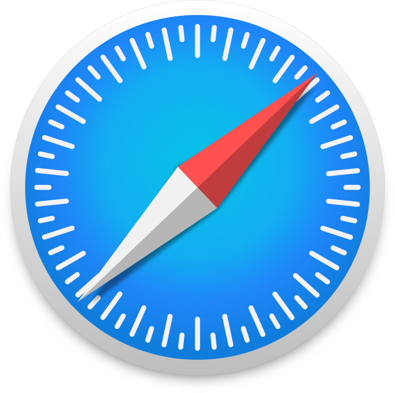

# 今月のフロントエンド

フロントエンド エンジニア集会 2026 年 9 月

---

## "今月のフロントエンド" とは

今月あったフロントエンドのニュースを, 以下のフォーマットで紹介します.

- ニュースがあった技術について, その名前かキーワード
- その技術に関する解説 (3 行目安)
- 何があったかを解説

---

## 取り上げないもの

- 特定フレームワークに関するバージョンアップ (例外あり)
- AI 単品のニュース

---

## Apple / Google / Microsoft / Mozilla / Igalia

2026/09/03

---

## "Apple" とは

- iPhone / iPad / Mac を作る, 米国の企業
- Web ブラウザ **Safari** と, そのエンジン **WebKit** を開発している
- WebKit はオープンソースとして公開されている

---

## "Google" とは

- 検索エンジンを中心とする, 米国の企業
- Web ブラウザ **Chrome** と, そのエンジン **Blink** を開発している
- 新しい Web 標準の実装を積極的に主導する立場にある

---

## "Microsoft" とは

- Windows を作る, 米国の企業
- Web ブラウザ **Edge** を開発している
- Edge は Chrome と同じ **Chromium** を基盤にしている

---

## "Mozilla" とは

- 非営利団体を母体とする, Web ブラウザの開発組織
- Web ブラウザ **Firefox** と, そのエンジン **Gecko** を開発している
- Chromium 系でない独自エンジンを維持する, 数少ない存在

---

## "Igalia" とは

- スペインを拠点とする, オープンソース専業の企業
- ブラウザエンジンの開発を **受託** する形で関わっている
- WebKit では Apple に次ぐ 2 番手, Chromium でも Google に次ぐ規模の貢献者

<!-- _footer: "出典: [Browsers and Client-side Web Technologies (Igalia)](https://www.igalia.com/technology/browsers)" -->

---

## Apple / Google / Microsoft / Mozilla / Igalia のニュース

**Interop 2027 の提案募集が始まった — 締切は 9/23**

- Interop = ブラウザ間で挙動が違う機能を, **5 者が 1 年かけて揃える** 取り組み
- 9/3, web.dev / WebKit / Edge の各ブログが同時に告知した
- **誰でも GitHub の Issue で提案できる**
- 条件は **成熟した Web 標準** であることと, **テストで測れること**

<!-- _footer: "出典: [Submit your proposals for Interop 2027 (web.dev)](https://web.dev/blog/interop-2027-proposals) / [Submit your ideas for Interop 2027 (WebKit)](https://webkit.org/blog/18283/submit-your-ideas-for-interop-2027/)" -->

---

## Google Chrome

2026/09/08


---

## "Google Chrome" とは

- Google が開発する, デスクトップで圧倒的なシェアを持つ Web ブラウザ
- レンダリングエンジンは Blink. 新しい CSS / Web API の実装を積極的に主導する
- Edge など, 他の Chromium 系ブラウザの基盤にもなっている

---

## Google Chrome のニュース

**リリース間隔が 4 週間から 2 週間になった**

- 9/8 公開の **Chrome 153** が, 新サイクルの 1 本目
- 次の Chrome 154 は **9/22** — 1 か月に 2 回, メジャー版が上がる
- デスクトップ / Android / iOS すべてが対象
- 企業向けの Extended Stable は **8 週間のまま** 据え置き

<!-- _footer: "出典: [Get features faster with Chrome's two-week release cycle (Chrome for Developers)](https://developer.chrome.com/blog/chrome-two-week-release)" -->

---

## なぜ短くするのか

- 1 回あたりの変更量が小さくなる
  → 問題が出たときに **どの変更が原因か切り分けやすい**
- 直した内容が利用者の手元に届くまでの待ち時間が半分になる
- Chrome のリリース間隔は 6 週 → 4 週 (2021 年) → **2 週** と, 短くなり続けている

---

## 開発者側で何が変わるか

- **バージョン番号で対応可否を語る前提が崩れる**
  → 番号の進みがほぼ倍になるため, 「Chrome 160 以降」のような指定が成立しにくい
- 機能が使えるかどうかは, `@supports` などで **その場で確かめる** 書き方が安全
- 動作確認の基準を特定バージョンで固定している場合は, 運用の見直しが必要

---

## Tailwind CSS

2026/09/09


---

## "Tailwind CSS" とは

- クラス名を並べて見た目を作る CSS フレームワーク
  (`class="flex gap-4 p-6"` のように書く)
- 2017 年公開. State of CSS 2025 では **利用率 51% で 1 位**
- 週 1.1 億回インストールされ, ChatGPT や X, Reddit などでも使われている

---

## Tailwind CSS のニュース

**開発元の Tailwind Labs を, Shopify が買収した**

- 9/9, 作者の Adam Wathan 氏が発表. 買収金額は非公開
- Tailwind CSS 本体は **MIT ライセンスのまま**, チームが維持を続ける
- 一方で **有料事業 (Tailwind Plus / ui.sh) は新規申込を停止** する
- 氏はこれを「安定した長期的な居場所を得た」と表現している

<!-- _footer: "出典: [Tailwind Labs is joining Shopify (Tailwind CSS Blog)](https://tailwindcss.com/blog/tailwind-is-joining-shopify)" -->

---

## Tailwind に関する直近のニュース

- **2026/01/06** — Tailwind Labs が, エンジニアの 75% を解雇
- **2026/01/07** — Wathan 氏が GitHub 上で解雇を公表.
  ドキュメントへのアクセスは 2023 年初頭から約 40% 減,
  売上は約 80% 減と説明した
- **2026/09/09** — Shopify による Tailwind Labs の買収を発表

<!-- _footer: "出典: [tailwindlabs/tailwindcss.com Pull Request #2388](https://github.com/tailwindlabs/tailwindcss.com/pull/2388)" -->

---

## とほほの WWW 入門

2026/08/21

---

## "とほほの WWW 入門" とは

- 1996 年から続く, 日本語の Web 技術解説サイト
- HTML / CSS / JavaScript から Perl, Docker, React, AI まで扱う範囲が広い
- 杜甫々 (とほほ) さんが個人で運営している

---

## とほほの WWW 入門 のニュース

**今月で, 開設から 30 年になる**

- 8/21 公開の登壇資料で, 管理人本人が
  「1996 年 9 月からなので, 来月で 30 年目」と紹介した
- つまり **2026 年 9 月で, 開設から満 30 年**
- 本人のインターネット歴は 1988 年から. サイトより 8 年長い

<!-- _footer: "出典: [杜甫々 登壇資料 (2026/08/21)](https://www.tohoho-web.com/ot/devsumi-tohoho_20260821.pdf)" -->

---

## 30 年ぶんが, 1 つの目次に載っている

- 開設当時の Web にあったもの
  → HTML 3.2, テーブルレイアウト, フレーム, CGI, アクセスカウンタ
- いま同じサイトに並んでいるもの
  → TypeScript, React, Docker, ローカル AI
- 管理人は 2025 年に本業を退職. その後も更新を続けている

<!-- _footer: "出典: [「とほほのWWW入門」30年目も更新中 (ITmedia NEWS)](https://www.itmedia.co.jp/news/articles/2603/13/news073.html)" -->

---

## 個人サイトが 30 年残るということ

- 1996 年当時の個人サイトの多くは, **置き場ごと消えている**
  (Yahoo! ジオシティーズはサービスごと 2019 年に終了した)
- 同じ人が同じサイトを 30 年更新し続けている例は, ほとんど残っていない
- 我々が検索して当たり前に読んでいるものは, 誰かが書き続けた結果でしかない

---

## Safari

2026/09/14



---

## "Safari" とは

- Apple が開発する Web ブラウザ. iPhone / iPad / Mac の標準ブラウザ
- レンダリングエンジンは WebKit
- iOS では他社ブラウザも WebKit を使うため, スマートフォンでの影響が大きい

---

## Safari のニュース

**Safari 27 公開 — `<select>` を CSS で自由に装飾できるようになった**

- 9/14 公開. 新機能 58 件, 修正 525 件 (近年で最大の修正数)
- `appearance: base-select` を指定すると **OS 標準の見た目が外れ**,
  CSS で自由に組み立てられるようになる
- Chrome 135 が先行実装済み. Safari 27 で **2 つ目のエンジン** が対応した

<!-- _footer: "出典: [Safari 27 Release Notes (Apple Developer)](https://developer.apple.com/documentation/safari-release-notes/safari-27-release-notes)" -->

---

## `<select>` の何が問題だったのか

- `<select>` の見た目は **OS 側が描いていた** ため, CSS がほとんど効かなかった
- デザインを合わせたい場合, `<div>` で作り直すのが定番の回避策だった
- しかし作り直すと, **キーボード操作や読み上げ対応を自前で実装する** ことになる
  → アクセシビリティが落ちやすく, 実装量も増える

---

## 書き方

```css
select {
  appearance: base-select; /* OS 標準の見た目を外す */
}
```

- これを指定した時点で, 装飾を CSS 側で組み立てられる状態になる
- 部品ごとの指定には, 専用の擬似要素が用意されている
  - `::checkmark` — 選択済みの項目に付く印
  - `::picker-icon` — 開閉を示す矢印

---

## 他ブラウザとの互換性

| ブラウザ      | `appearance: base-select` |
| ------------- | ------------------------- |
| Chrome / Edge | 135〜                     |
| Safari        | **27〜**                  |
| Firefox       | Nightly でフラグ付き      |

- 未対応ブラウザでは **指定が無視され, 標準の `<select>` のまま表示される**
  → 機能は壊れない. 段階的に導入できる
- ただし **見た目は揃わない** ため, どちらでも成立するデザインが必要

---

## Safari 27 のその他の変更

- **スクロール位置の固定**: 上の方に画像が読み込まれても, 表示位置がずれなくなる
- **アンカー位置指定が transform に追従**: 拡大や回転をする要素に吹き出しを
  くっつけても, ずれずについていく
- `:heading` (見出しをまとめて指定), `revert-rule`, `stretch` などの CSS が追加
- WebAssembly から JavaScript の非同期処理を待てる **JSPI** に対応

---

## jQuery

2026/08/26


---

## "jQuery" とは

- 2006 年に登場した, JavaScript を短く書くためのライブラリ
- `$("#id")` のような書き方で, 画面の要素を取ってきて操作できる
- 登場当時はブラウザごとに書き方が違い, **その差を吸収する** ことが最大の価値だった

---

## jQuery のニュース

**jQuery 1.0 の公開から 20 年が経った**

- 2006/08/26 に jQuery 1.0 が公開. 2026/08/26 でちょうど 20 年

<!-- _footer: "出典: [jQuery 1.0 (Official jQuery Blog)](https://blog.jquery.com/2006/08/26/jquery-10/)" -->

---

## jQuery の今

- W3Techs の調査では, いまも全 Web サイトの **66.4%** が jQuery を読み込んでいる
- 同じ調査での React は 6.1%
- 2026/01 には, 10 年ぶりのメジャー版 jQuery 4.0.0 が公開された

<!-- _footer: "出典: [Usage statistics of jQuery (W3Techs)](https://w3techs.com/technologies/details/js-jquery)" -->

---

# おわり
